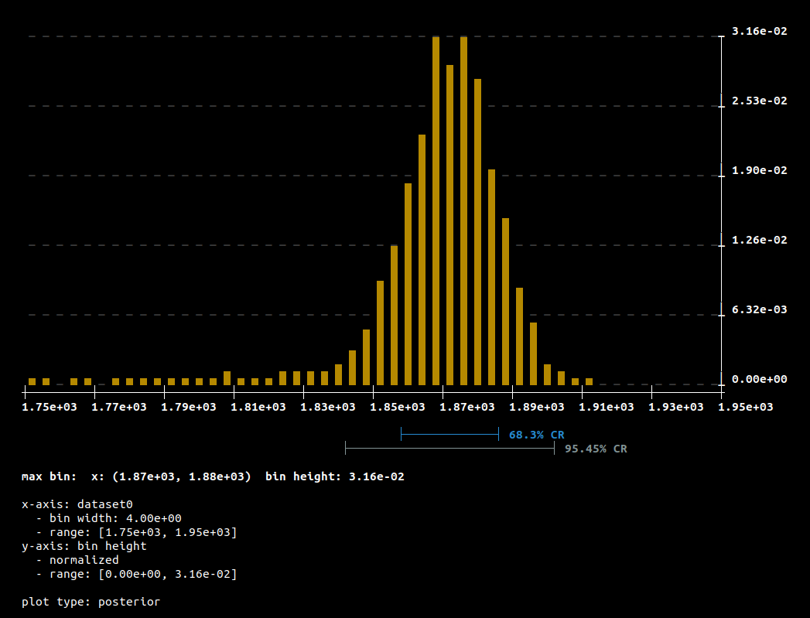
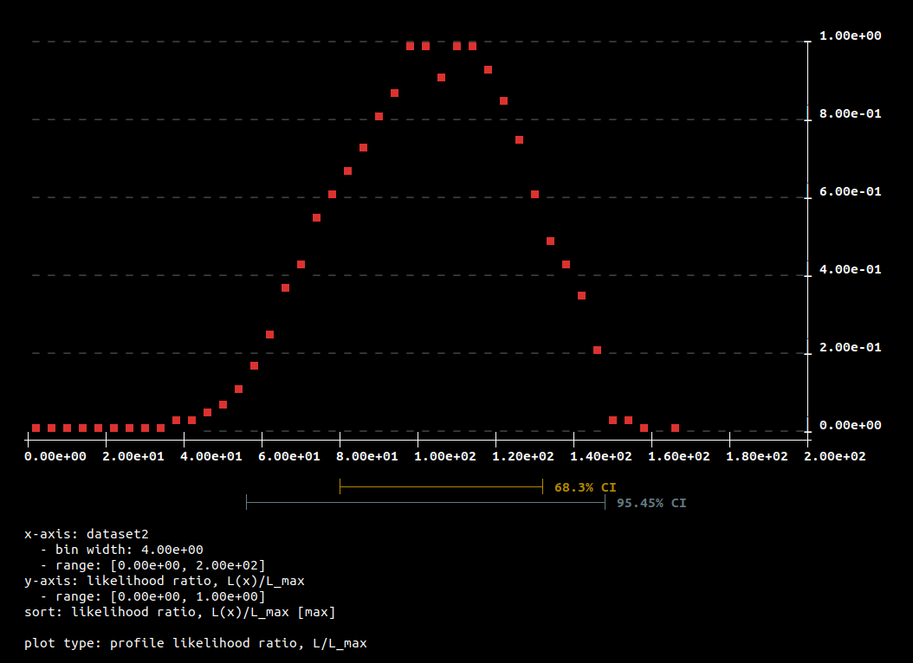
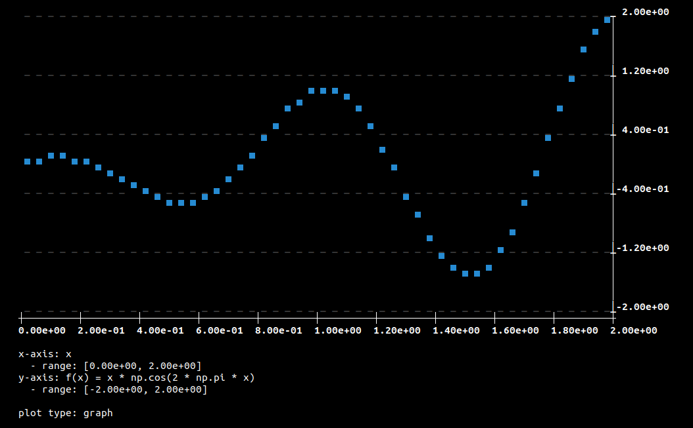
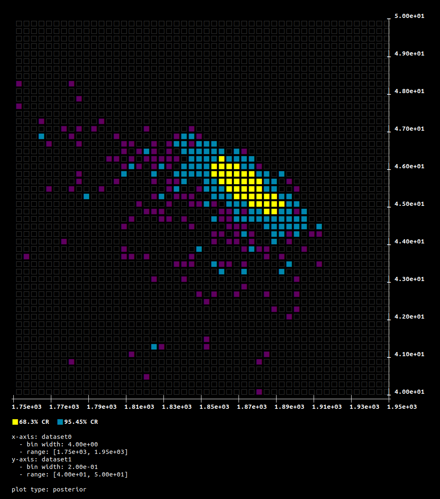
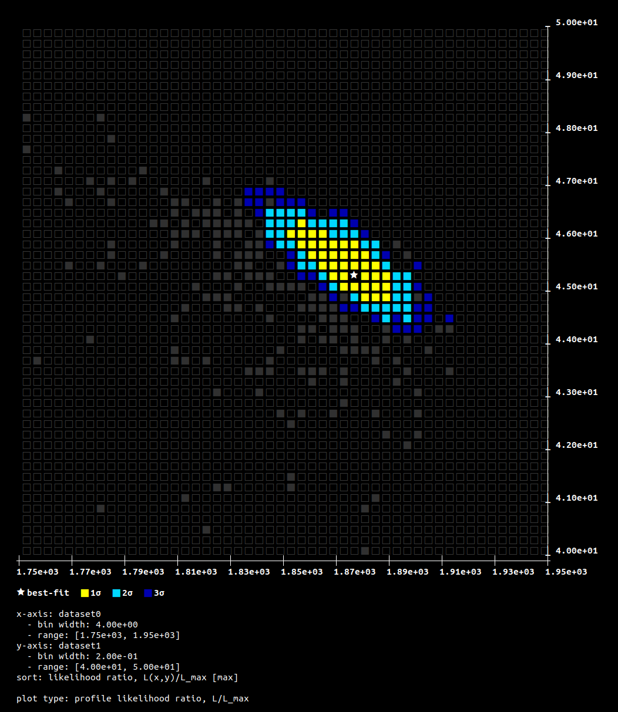
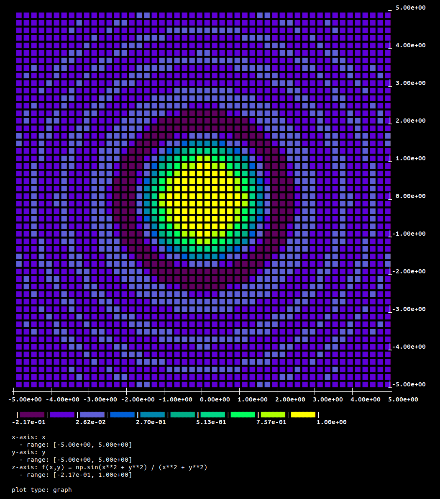

# sup — the Simple Unicode Plotter

`sup` is a command-line tool for generating quick 1D and 2D data visualizations directly in the terminal using Unicode characters and ANSI colors. It can plot data from files (text or HDF5) or from piped input, or plot mathematical functions evaluated by `sup` directly. 

    

    

## But why?

I often find while doing terminal-based work (e.g. running scientific computations on HPC clusters) that I want to quickly check or monitor the content of some data file — for instance check different 1D and 2D histograms/posteriors and profile likelihood maps. So I wrote `sup` as a lightweight tool for displaying rough versions of such plots directly in the terminal, to minimize the disruption to my ongoing workflow.


## Features

*   Multiple run modes:
    *   `hist1d`, `hist2d`: 1D and 2D histograms.
    *   `max1d`, `max2d`, `min1d`, `min2d`, `avg1d`, `avg2d`: Plotting max, min, or average values.
    *   `post1d`, `post2d`: 1D and 2D posterior probability distributions.
    *   `plr1d`, `plr2d`: Profile likelihood ratios.
    *   `chisq1d`, `chisq2d`: Delta chi^2 plots.
    *   `graph1d`, `graph2d`: Plotting functions y=f(x) and z=f(x,y).
    *   `list`: List dataset names and indices from input files.
    *   `colors`, `colormaps`: Display available colors and colormaps.
*   Supports text and HDF5 input files.
*   Supports piping data from stdin for text and CSV formats.
*   Customizable plot size, ranges, transformations (e.g., log scale).
*   Color and grayscale output, with optional white background.
*   Various colormaps for 2D plots.

## Installation

Simply install using `pip`:

```terminal
pip install git+https://github.com/anderkve/sup.git
```

This will install the `sup` terminal command.

## Dependencies

*   Python >= 3.6
*   numpy
*   scipy
*   h5py (if working with HDF5 files)

## Usage

Once installed you can use the `sup` command from your terminal.

**General syntax:**
`sup <mode> [options...]`

Run `sup --help` to see all available modes and options. 

To see all the options for a specific run mode, do `sup <mode> --help`.

## Examples

**List datasets in a file:**
```bash
sup list data.hdf5
sup list data.txt --delimiter ","
```

**Plot a 1D histogram from `posterior.dat` (column 0):**
```bash
sup hist1d posterior.dat 0 -sz 40 20 -wb
```
(The `posterior.dat` file is included in the `tests` directory of this repository.)

**Plot a 1D function `y = x * cos(2*pi*x)`:**
```bash
sup graph1d "x * np.cos(2 * np.pi * x)" --x-range 0.0 2.0 --y-range -2 2 -sz 40 20
```

**Plot a 2D histogram from `posterior.dat` (columns 0 and 1):**
```bash
sup hist2d posterior.dat 0 1 -sz 40 40
```

**Plot a 2D function `z = sin(x^2 + y^2) / (x^2 + y^2)`:**
```bash
sup graph2d "np.sin(x**2 + y**2) / (x**2 + y**2)" --x-range -5 5 --y-range -5 5 -sz 40 40
```

**Plotting from stdin (e.g., via pipe):**
```bash
# Plot column 0 from piped space-delimited text data with header '# val1 val2'
# (Assumes my_data.txt has a header compatible with 'txt' format if not just numbers)
cat my_data.txt | sup hist1d - 0 --stdin-format txt --delimiter " "

# Plot column 1 from piped CSV data (e.g., headers: col0,col1,col2)
cat my_data.csv | sup hist1d - 1 --stdin-format csv

# List datasets from piped CSV data
cat my_data.csv | sup list - --stdin-format csv
```
Note: When using stdin ("-") as the input file, the `--stdin-format` argument is required. Supported formats for stdin are 'txt' (for general delimited text files) and 'csv' (for comma-separated values files, assumes first line is header). HDF5 data format is not supported from stdin. The `--delimiter` option is used for 'txt' format.

**More examples from `sup --help`:**
```
modes:
  sup list        list dataset names and indices
  sup hist1d      plot the x histogram
  sup hist2d      plot the (x,y) histogram
  sup max1d       plot the maximum y value across the x axis
  sup max2d       plot the maximum z value across the (x,y) plane
  sup min1d       plot the minimum y value across the x axis
  sup min2d       plot the minimum z value across the (x,y) plane
  sup avg1d       plot the average y value across the x axis
  sup avg2d       plot the average z value across the (x,y) plane
  sup post1d      plot the x posterior probability distribution
  sup post2d      plot the (x,y) posterior probability distribution
  sup plr1d       plot the profile likelihood ratio across the x axis
  sup plr2d       plot the profile likelihood ratio across the (x,y) plane
  sup chisq1d     plot the delta chi^2 across the x axis
  sup chisq2d     plot the delta chi^2 across the (x,y) plane
  sup graph1d     plot the function y = f(x) across the x axis
  sup graph2d     plot the function z = f(x,y) across the (x,y) plane
  sup colormaps   display the available colormaps
  sup colors      display the colors available for creating colormaps (for development)

examples:
  sup list data.hdf5

  sup list data.txt --delimiter ","

  sup hist1d data.txt 0 --x-range -10 10 --size 100 20 --y-transf "np.log10(y)" --delimiter ","

  sup hist2d data.txt 0 1 --x-range -10 10 --y-range -10 10 --size 30 30 --delimiter "," --colormap 1

  sup post2d posterior.dat 2 3 --x-range -10 10 --y-range -10 10 --size 30 30 --delimiter " "

  sup plr2d data.hdf5 0 1 4 --x-range 0 10 --y-range 0 10 --size 20 20

  sup plr2d data.hdf5 2 1 4 --x-range 0 10 --y-range 0 20 --size 20 40 --x-transf "np.abs(x)"

  sup graph1d "x * np.cos(2 * np.pi * x)" --x-range 0.0 2.0 --y-range -2 2 --size 40 20 --white-bg

  sup graph2d "np.sin(x**2 + y**2) / (x**2 + y**2)" --x-range -5 5 --y-range -5 5 --size 50 50
```


## License
This project is licensed under the GNU General Public License v3 (GPLv3+). See the file `LICENSE` for details.

